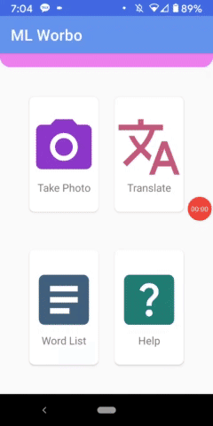
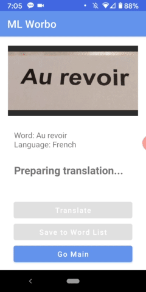

# mlworbo
## mobile application using Kotlin

- This is an app for English speakers who want to translate foreign languages. 
- Users take a picture of any text using the camera function in the app.
- The app recognizes the language of the text and translates it into English.
- Users can save the word’s information in a words list.

   

## Description of Application Details

### Main activity – CardView
There are four card views you can click on.
- Take Photo -> Goes to the Camera Activity
- Translate -> Goes to the OCR & Translation Activity
- Word List -> Goes to the Word list Activity
- Help -> Goes to the Help Activity
              
### Camera Activity – CameraX, Android-Image-Cropper
- You can take a photo using the camera x function and then it automatically takes you to crop the image.
- Cropper has Rotate, Flip horizontally and Flip vertically functions.
- If you push Crop button, the photo is saved in your device.
- You can go back to main by pushing < button on your device.

### OCR & Translation Activity - NestedScrollView
- If you push the ‘Translate’ card view, you can see the photo you recently saved.
- The app recognizes the text on the image and shows what the word is and what language it’s in.
- If the app successfully identifies the language, it starts downloading the translation model and the Translate button would be enabled. (It takes a little time.)
- If you push the Translate button, you can see the result in English.
- You can save the word’s information to the word list.
- After you save the word, you’ll be back in main and the word won’t be displayed on this activity anymore. 
- But if the app cannot identify the language or fails to download the model, ‘Sorry translation failed’ will be shown.
- If you don’t save the photo, ‘NO IMAGE’ image will be displayed when you open this activity.

 ### Word List Activity – RecyclerView & CardView
- The current entries in the word list are displayed in individual CardViews showing the image and the source word.
- You can click the card to open the Word Activity.

### Word Activity – NestedScrollView
- You can see the details of the selected word entry.
- Image, Source word from the image, Language of the source word and translated word
- You can remove the word from the list.
